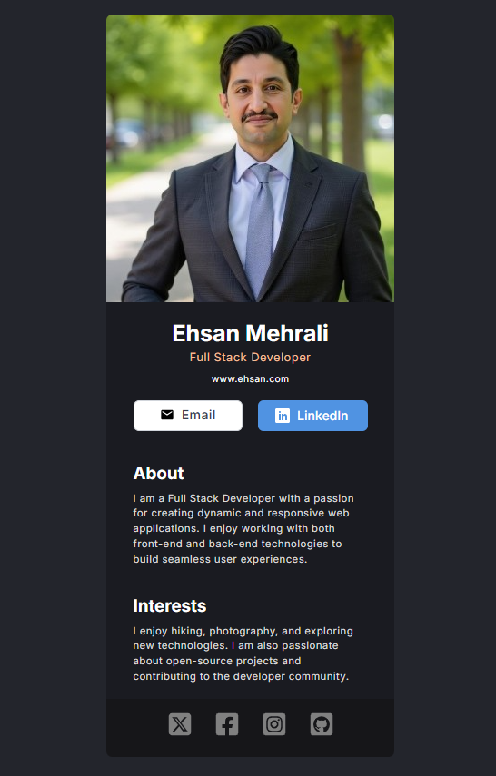

# 💼 Digital Business Card

This is a simple digital business card project built using **React**, **Vite**, and **CSS**. The project displays a personal profile card with a photo, contact buttons, a short bio, and social media links.

> ⚠️ This project is based on the [Scrimba Frontend Path](https://scrimba.com/learn/frontend) design idea. However, the implementation and styling are fully done by me from scratch.

## 📸 Preview



## 🚀 Technologies Used

- [React](https://reactjs.org/)
- [Vite](https://vitejs.dev/)
- [CSS](https://developer.mozilla.org/en-US/docs/Web/CSS)
- `.env` for environment configuration

## 📂 Project Structure

```bash
├── asset
│   └── profile.jpg
├── src
│   ├── components
│   │   ├── About.jsx
│   │   ├── Buttons.jsx
│   │   ├── Footer.jsx
│   │   ├── Image.jsx
│   │   ├── Info.jsx
│   │   └── Interests.jsx
│   ├── App.jsx
│   ├── index.css
│   └── main.jsx
├── .env
├── public
├── index.html
└── ...
```

## ⚙️ Environment Variables

This project uses environment variables for dynamic configuration such as social media URLs or contact links.
To run the project correctly, create a .env file in the root directory with content like this:

```env
VITE_EMAIL_URL="mailto:example@example.com"
VITE_LINKEDIN_URL="https://linkedin.com/in/yourprofile"
VITE_TWITTER_URL="https://twitter.com/yourhandle"
VITE_GITHUB_URL="https://github.com/yourhandle"
```

🔐 Note: All environment variables in Vite must be prefixed with VITE\_ to be accessible in the app.

## 🧪 How to Run Locally

#### 1. Clone the repository:

```bash
git clone https://github.com/your-username/digital-business-card.git
cd digital-business-card
```

#### 2. Install dependencies:

```bash
npm install
```

#### 3. Create a .env file and add the necessary environment variables (as described above).

#### 4. Start the dev server:

```bash
npm run dev
```

#### 5. Open in browser:

Navigate to http://localhost:5173

## ✍️ Author

<h4>Ehsan Mehrali</h4>
<p>Full Stack Developer</p>

## 📜 License

This project is for educational and practice purposes only.
